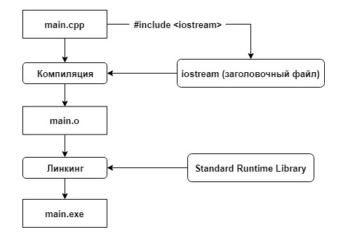

##Язык программирования C++ Урок №3 
##Прототипы функций и Предварительное объявление

При работе программы компилятор проходит по программе последовательно 
собственно как и компилятор, и находя вызов функции пытается найти на нее 
ссылку, если функция определена позднее места своего вызова, то у компилятора
еще нету на нее ссылки, по этому мы получим ошибку. 

Мы можем указать компилятору о предварительном обьявлении функции до места ее
реального определения, это называется  **Прототипы функций**:

    #include <iostream>
     
    // предварительное объявление функции add() (используется её прототип)
    int add(int x, int y); 
     
    int main()
    {
        std::cout << "The sum of 3 and 4 is: " << add(3, 4) << std::endl; // это работает, так как мы предварительно (выше функции main()) объявили функцию add()
        return 0;
    }
     
    // Само определение функции  
    // хотя определение функции add() находится ниже её вызова
    int add(int x, int y) 
    {
        return x + y;
    }

Если функция обьявлена при помощи прототипного обьявления, но не определена 
то ничего страшного не произойдет, но если она не определена но используется 
в программе, то мы получим ошибку на стадии **Компановщика(Линкинга)**.

###Много файловый проект 
Если в нашем проекте больше одного файла, то их можно скомпелировать в 
финальный exe указав в команде компиляции для GCC.

    g++ main.cpp add.cpp -o main 

Таким образом мы указываем какие файлы скомпоновать в финальный файл с 
машинным кодом, но этого ещ ене достаточно, чтобы использовать функцию из
другова фала нам потребуется обьявить ее прототип в том файле, котором мы 
его хотим использовать.

####Файл main.cpp
    
    #include <iostream>
    
    // Прототипы для функции из другова файла
    int add (int x, int y);
    
    int main() {
        std::cout << "Результат сложения 2-х чисел: " << add(3,4) << std::endl;
        return 0;
    }
 
####Файл add.cpp

    int add(int x, int y)
    {
        return x + y;
    }   

###Заголовочные файлы
Когда файлов становится много и в каждом следует обьявлять прототипы функций
которые мы хотим использовать в текущем файле, этих обьявлений становится 
слишком много, чтобы избежать этйо избыточности, используются 
**заголовочные файлы ( Заголовки )** и используют расширение `.h`  в которых 
сразу описаны все обьявления которые нам могут потребоваться.

Тоесть в нашем проекте есть 2 типа файлов, сами файлы с програмным кодом и 
заголовочные файлы с обьвлениями функций.

В качестве примера приведем уже подключаемую нами `#include <iostream>`
Это iostream.h файл, заголовочный файл, в котором обьявлены функции 
по типу ввода/вывода в терминал `std::cout std::endl std ::cin` они там
обьявлены но не определены, определены они в стандартной библиотеке языка `C++`
и эти библиотеки как уже скомпилированные в машинный код стандартные 
библиотеки языка `C++` дключаются не на этапе компиляции а на этапе
обьеденения обьектных файлов, на этапе Линкинга(Компановки).

    #include <iostream>
 
    int main()
    {
        std::cout << "Hello, world!" << std::endl;
        return 0;
    }
        
Вот пример того как это работает:

 
###Теперь напишим свои собственные заголовочные файлы.
Заголовочные файлы состоят из 2-х частей:
    
1) Директивы препроцессора - Header Guards их задача предотвращать вызов заголовочного
   файла более одного раза из одного и тогоже файла.
2) Содержимое заго-го файла - набор обьявлений и только, не определений.

Все Заголовочные файлы должны иметь расширение `.h` Опишим заголовочный файл с
названием `add.h` :

    // Начнем с директив препроцессора. ADD_H – 
    // это произвольное уникальное имя (обычно используется имя заголовочного файла)
    #ifndef ADD_H
    #define ADD_H
    
    // А это уже содержимое заголовочного файла
    int add(int x, int y); 
    // прототип функции add() (не забывайте точку с запятой в конце!)
    
    // Заканчиваем директивой препроцессора
    #endif

Подключается этот заголовочный файл к проекту также как и другие.

    #include <iostream>
    #include "add.h"

Когда препроцессор доходит до `#include "add.h"` он включает все содержимое 
этого заголовочного файла в код своей программы.

 