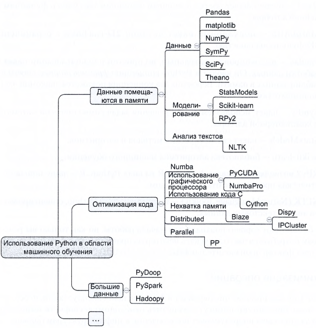

## Машинное обучение
В основном используется на этапе построения моделей, но может 
и на период всего процесса, начиная с момента получения данных для 
анализа.

Библиотеки Python для работы с данными, используемые для построения 
прототипа:

1) SciPy библиотека для интеграции других библиотек
2) NumPy дает доступ к функциям массивов и линейной алгебры
3) MatPlotLib 2D и 3D графика
4) Pandas таблица данных в памяти, предост таблиц в виде фреймов
5) SymPy дял компьютерной алгебры
6) StatsModels пакет статистических методов и алгоритмов
7) Scikit-learn библиотека пакетов машинного обучения
8) NLTK работа с текстом

Оптимизация операций: После того как приложение начет работать в 
реальных, боевых условиях след-е библиотеки обеспечивают скорость 
разработки.

1) Numba и NumbaPro подключают JIT компилятор 
2) PyCUDA для интенсивных вычислений
3) PySpark инфраструктура дял работы с большими данными

### Моделирование
Процесс моделирования, происходит в 4 шага:
1) Выбор модели
2) Тренировка модели
3) Проверка модели
4) тренировка на незнакомых данных

Несколько методов могут обьеденяться в цепочки, так результат работы 
одного метода становится аргументом рботы другова.

Модель состоит из информационных конструкций, которые называются 
`показателями` или `свободными переменными` и `целевыми переменными`

Основной целью модели является прогнозирование `целевой переменной`.
Свободные же переменные используются для этого самого прогнозирования,
к примеру на основе свободных переменных(температуры, погдных условий)
что были известны за превыдущие дни, происходит прогнозирвоание целевой 
переменной(темературы на завтра).

Первое что требуется сделать, это определить возсожные свободные 
переменные.

Проверка адекватности модели - после построения модели, проверка происходит
при помощи `матрики погрешности` к примеру `среднеквадратичная погрешность`

Две распрастраненные метрики погрешностив машинном обучении:
1) **Частота ошибок классификации** для задачть классификации
2) **Среднеквадратичная погрешность** для регрессионных задачь

Частота ошибок классификации - наблюдение процента неправильно 
классифицированных данных, чем он меньше тем лучше.

Среднеквадратичная погрешность - величина средней погрешности 
прогнозирования. Возведение средней погрешности в квадрат имеет 2 
последствия:

1) Неверное прогнозирование в одном направлении не может быть 
скомпенсированно другим.
2) Большие ошибки при возведении в квадрат имеют больший вес.

### Проверка адекватности
Самые распространенные стратегии проверки адекватности:

1) Разбиение данных на тренировочный на бор с X% наблюдений и 
   контрольную выборку с остальными данными(данные которые мы не
   используем при обучении как с 80/20 %)
2) К-кратная перекрестная проверка - набор данных делится на k-частей
   каждая часть однократно используется как тестовый набор данных, 
   а другие формируют тренировочный набор.
3) Исключение еденицы - идентичен с k-частей но только k = 1.
    работает в основном с малым набором данных

### Регуляризация
Термин машинного обюучения - подразумевает внесение штрафа за каждую
дополнительную переменную при построении модели. Их бывает 2 типа:

1) L1 регуляризация - строится модель с минимальным количеством
   переменных.
2) L2 регуляризация - направлена на минимизацию расхождениямежуд
   коэффециентами свободных переменных.

### Типы Машинного обучения
1) Контролируемое обучение - пытаются различать результаты и учитсья на 
   них, требуется разметка данных и участие человека.
2) Неконтролируемое обучение - данные ищутся без участия человека.
3) Частично контролируемое - среднее.

### Контролируемое обучение
К примеру капча, для ее распознавания можно использовать 
`наивный Байесовский классификатор`. 

### Неконтролируемое обучение

### Частично контролируемое

