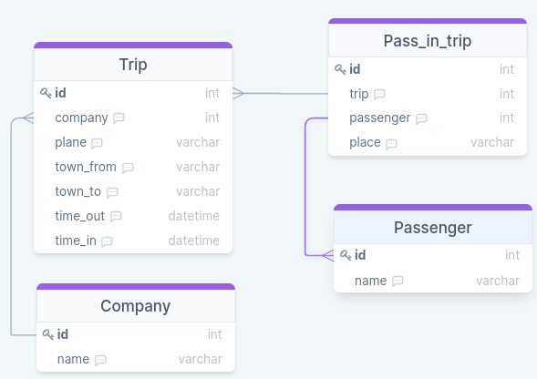

##SQL Урок 1

####1) Вывести все рейсы, совершенные из Москвы 
   
        SELECT * FROM Trip
        WHERE town_from = 'Moscow';

####2) Вывести имена людей, которые заканчиваются на "man"
LIKE() - функция что ищет по паттерну, символ % указывает нацти в конце строки,
так что используем '%man'.

       SELECT name
       FROM Passenger
       WHERE name LIKE('%man');

####3) Вывести количество рейсов, совершенных на TU-134
Видим что требуется количество, значит используем функцию COUNT() так образ 
считаем количество там где такойто вид самолета.

       SELECT COUNT(*) as count
       FROM Trip
       WHERE plane = 'TU-134';   

####4) Какие компании совершали перелеты на Boeing
Тут сразу видим что требуется взять компании, значит используем таблицу Company.
И требуются типы самолетов которые есть только в таблице Trip. Так образом тут 
учавствуют сразу 2 таблицы, так что делаем Join

       SELECT DISTINCT cm.name
       FROM Company as cm
       JOIN Trip as tr ON cm.id = tr.company
       WHERE tr.plane = 'Boeing';

####5)Вывести все названия самолётов, на которых можно улететь в Москву (Moscow)

        SELECT DISTINCT plane
        FROM Trip
        WHERE town_to = 'Moscow';

####6)В какие города можно улететь из Парижа (Paris) и сколько времени это займёт?

####7)
####8)
####9)
####10)

