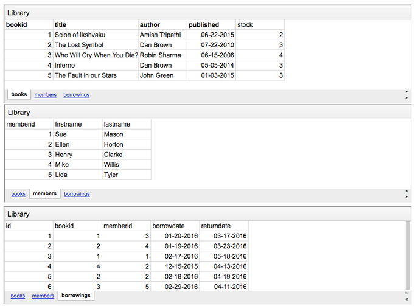

##SQL Урок 6

Аналитические виндов, оконные функции, интервальные таблицы, 
события смены статуса, распарсить эти события в смену статуса, 
одним SQL собрать интервальную таблицу по которой можно увидеть статус смены состояний.

###Порядок предложений в инструкции SELECT.
Порядок построения инструкции SELECT:

SELECT - получение строк

FROM - откуда

WHERE - фильтрация на уровне строк

GROUP BY - группировка 

HAVING - фильтрация на уровне групп

ORDER BY - порядок сортировки

LIMIT, OFFSET - Вывести указанное колличество из результата 

###Подзапросы

###Примеры запросов
1. Вывести самое большое значение не равное максимальному значению по всей таблице.
Или если проще, найти второе по максимуму число в столбце.

    SELECT prod_price
    FROM Products;

        // Ответ
        12
        9
        6
        3
        3

    SELECT MAX(prod_price)
    FROM Products
    WHERE prod_price !=
        (
            SELECT MAX(prod_price)
            FROM Products
        )
        
        // Ответ    
        9

2. У нас есть 3 таблицы: Книги, Подписчики, Взятые книги

Вывести названия всех книг и время когда их должны вернуть
написанные автором Dan Brown.

    // Ответ
    SELECT bk.title, br.returndate 
    FROM books AS bk
    INNER JOIN borrowings AS br ON bk.bookid = br.bookid
    WHERE bk.author = 'Dan Brown';

3. Теперь мы хотим получить имена и фамилии людей, 
   которые взяли из библиотеки книги автора “Dan Brown”.
   

    SELECT mb.firstname, mb.lastname
    FROM books AS bk
    INNER JOIN borrowings AS br ON bk.bookid = br.bookid
    INNER JOIN memberd AS mb ON mb.memberid = br.memberid
    WHERE bk.author = 'Dan Brown';

    // Ответ
    First Name  |  Last Name
    ------------------------
        Mike    |   Willis
        Ellen   |   Horton
        Ellen   |   Horton

4. 

