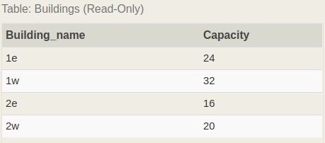
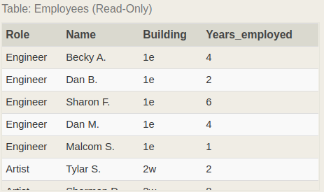
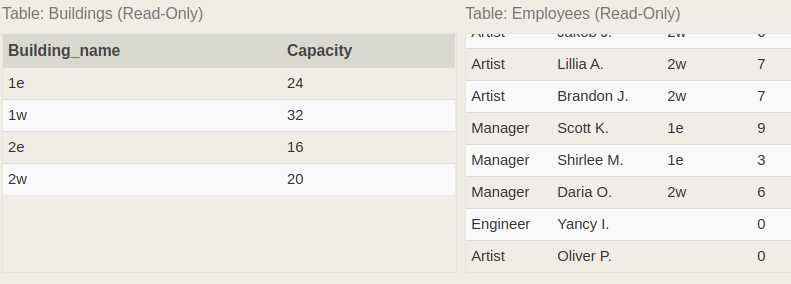
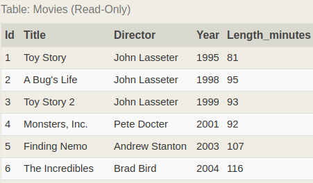
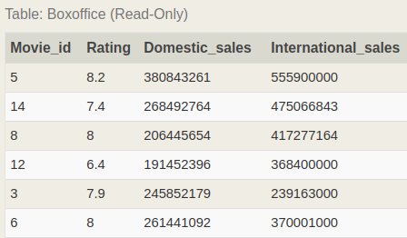
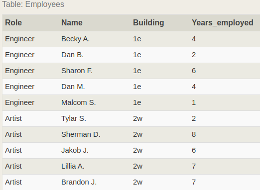
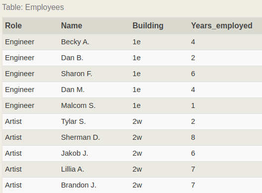
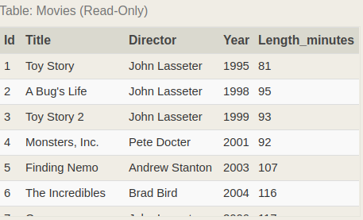
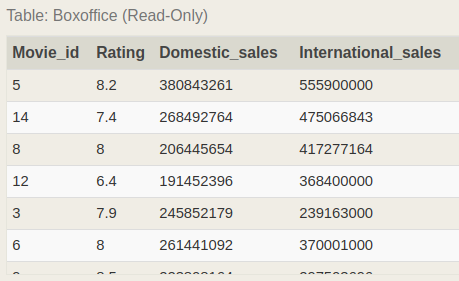

###SQL Урок 8 по материалам сайта https://sqlbolt.com/
Примеры SQL запросов.

alphabetically - в алфовитном порядке
domestic  - внутренний домашний в нутри страны
international - в мире интернациональный
descending order - порядке убывания
Capacity - вместимость
even - Четный
Inserting rows - Вставка строк

У нас есть таблиуа вида:

1.Find the movies released in the years between 2000 and 2010

    SELECT * 
    FROM movies
    WHERE year BETWEEN '2000' AND '2010';

2.Find the movies not released in the years between 2000 and 2010

    SELECT * 
    FROM movies
    WHERE year NOT BETWEEN '2000' AND '2010';

3.Find the first 5 Pixar movies

    SELECT * FROM movies LIMIT 5;

4.Find all the Toy Story movies

    SELECT * 
    FROM movies
    WHERE title LIKE('Toy Story%');

    /// Ответ
    1	Toy Story	John Lasseter	1995	81
    3	Toy Story 2	John Lasseter	1999	93
    11	Toy Story 3	Lee Unkrich	2010	103

5.Find all the movies directed by John Lasseter

    SELECT *
    FROM movies
    WHERE director = 'John Lasseter';

6.Find all the movies (and director) not directed by John Lasseter

    SELECT * 
    FROM movies
    WHERE director != 'John Lasseter';

7.Find all the WALL-* movies

    SELECT * 
    FROM movies
    WHERE title LIKE('WALL-%');

8.List all directors of Pixar movies (alphabetically), without duplicates

    SELECT DISTINCT director
    FROM movies
    ORDER BY director ASC;

9.List the last four Pixar movies released (ordered from most recent to least)

Инструкция LIMIT опциональна и является частью конструкции ORDER BY тоесть
мы выбрали все до единой записи из таблицы, отсортировали ее в противоположном 
порядке, и просто выбираем из них первые 4, которые по итогу являются последними 
4 записями из первоначальной таблицы.

    SELECT title, year 
    FROM movies
    ORDER BY year DESC
    LIMIT 4;

10.List the first five Pixar movies sorted alphabetically

    SELECT *
    FROM movies
    ORDER BY title
    LIMIT 5;

11.List the next five Pixar movies sorted alphabetically

    SELECT * 
    FROM movies
    ORDER BY title
    LIMIT 5 OFFSET 5;

###Новая таблица, города Северной Америки.

12.List all the Canadian cities and their populations

    SELECT * FROM
    north_american_cities
    WHERE country = 'Canada';

13.Order all the cities in the United States by their latitude from north to south

    SELECT * 
    FROM north_american_cities
    WHERE country = 'United States'
    ORDER BY latitude DESC;

    City	 Country	Population	 Latitude	Longitude
    Chicago	 United States	2718782	41.878114	-87.629798
    New York	United States	8405837	40.712784	-74.005941
    Philadelphia	United States	1553165	39.952584	-75.165222
    Los Angeles	United States	3884307	34.052234	-118.243685
    Phoenix	United States	1513367	33.448377	-112.074037
    Houston	United States	2195914	29.760427	-95.369803

14.List all the cities west of Chicago, ordered from west to east

    SELECT city, longitude FROM north_american_cities
    WHERE longitude < -87.629798
    ORDER BY longitude ASC;

    
15.List the two largest cities in Mexico (by population)

    SELECT city, population FROM north_american_cities
    WHERE country LIKE "Mexico"
    ORDER BY population DESC
    LIMIT 2;

16.List the third and fourth largest cities (by population) 
in the United States and their population.

Вывести из городов Америки 3 и 4 по уровню популяции города

    SELECT *
    FROM north_american_cities
    WHERE country = 'United States'
    ORDER BY population DESC
    LIMIT 2, 2;

###Работа с INNER JOIN

Форма записи для INNER JOIN:

    Выберите запрос с INNER JOIN для нескольких таблиц
    SELECT column, another_table_column, …
    FROM mytable
    INNER JOIN another_table
    ON mytable.id = another_table.id
    WHERE condition(s)
    ORDER BY column, … ASC/DESC
    LIMIT num_limit OFFSET num_offset;

Фильмы

Продажи фильмов

Рузультирующая таблица

1.Find the domestic and international sales for each movie

    SELECT mv.id, mv.title, bx.domestic_sales ,bx.International_sales
    FROM movies AS mv
    INNER JOIN boxoffice AS bx ON mv.id = bx.movie_id;
    

2.Show the sales numbers for each movie
that did better internationally rather than domestically

    SELECT mv.id, mv.title, 
    bx.domestic_sales ,bx.International_sales
    FROM movies AS mv
    INNER JOIN boxoffice AS bx ON mv.id = bx.movie_id
    WHERE bx.International_sales > bx.domestic_sales;

3.List all the movies by their ratings in descending order

    SELECT mv.*, bx.Rating
    FROM movies AS mv
    INNER JOIN boxoffice AS bx ON mv.id = bx.movie_id
    ORDER BY bx.Rating DESC;

### Примеры с JOIN

Здания

Рабочие

1. Find the list of all buildings that have employees

Найти все здания у которых есть рабочие что его строили, тоетсь тут 
применяется INNER JOIN для выборки зданий у которых есть рабочие.

Первое решение, находим в таблице работников уникальные записи по полю
что ответственно за связь с таблицей зданий.

    SELECT DISTINCT building FROM employees

2. Find the list of all buildings and their capacity

Найти все здания и их вместимость

    SELECT * FROM Buildings;

3. List all buildings and the distinct employee roles 
   in each building (including empty buildings)
   
Перечислите все здания и уникальных сотрудников для каждого 
здания (включая пустые)

    SELECT DISTINCT building_name, role
    FROM buildings
    LEFT JOIN employees
    ON building_name = building;

4. Find the name and role of all employees who have 
   not been assigned to a building
   
Получить Названия и Роли всех сотрудников которые не принимали участи в 
роительстве имеющихся зданий.

Тоесть мы должны получить всех сотрудников у которых в связке
по полям Building/Building_name нету взаимосвязи. Это явно JOIN по таблице
employees со связкой по полям Building = Building_name. Когда мы создадим 
этим запросом временную таблицу состаяющую из 2 таблиц, те записи из таблицы
сотрудников где Building не определен для зданий по полю Building_name будут
иметь значение NULL. Тоетсь нам останется только выбрать записи где по полю
Building_name является равным NULL.

    SELECT em.Name, em.Role
    FROM employees AS em
    LEFT JOIN Buildings AS bl
    ON em.Building = bl.Building_name
    WHERE bl.Building_name IS NULL;

    // Ответ
    Name	   |   Role
    --------------------
    Yancy I.   |   Engineer
    Oliver P.  |   Artist
    
5. Find the names of the buildings that hold no employees

Найти названия зданий у которых нету работников.
   
      SELECT bl.Building_name
      FROM Buildings AS bl
      LEFT JOIN employees AS em
      ON bl.Building_name = em.Building
      WHERE em.Building IS NULL;

      //Ответ
      Building_name
      -------------
      1w
      2e

### Примеры с подсчетами

6. List all movies and their combined sales in millions of dollars

      SELECT mv.Id, mv.Title, 
      (bx.Domestic_sales + bx.International_sales) / 1000000 AS millions_of_dollars
      FROM Movies AS mv
      INNER JOIN Boxoffice AS bx ON mv.ID = bx.Movie_id
      ORDER BY mv.Id;
      

7. List all movies and their ratings in percent

      SELECT mv.*, bx.Rating * 10 AS Rating_in_percent
      FROM Movies AS mv
      INNER JOIN Boxoffice AS bx 
      ON mv.Id = bx.Movie_id
      ORDER BY mv.Id;

8. List all movies that were released on even number years

Вывести все фильмы что были выпущены по четным годам.

Берем год делим на 2 с отсатком и смотрим чтобы остаток был равен нулю, 
что означает что число делится на 2 тоесть четное.

      SELECT mv.* 
      FROM Movies AS mv
      WHERE (mv.Year % 2) = 0;

### Запросы с Агрегатными функциями

1. Find the longest time that an employee has been at the studio

   
      SELECT MAX(em.Years_employed)
      FROM Employees AS em;

2. For each role, find the average number of years employed 
   by employees in that role

      SELECT em.Role, AVG(Years_employed) AS avg_years
      FROM Employees AS em
      GROUP BY em.Role
      ORDER BY em.Role;

      // Ответ
      Role	   |   Avg_years
      ---------------------------
      Artist   |    6
      Engineer |    3.4
      Manager  |    6

3. Find the total number of employee years worked in each building

      SELECT em.Building, SUM(em.Years_employed) AS avg_years_summ
      FROM Employees AS em
      GROUP BY em.Building
      ORDER BY em.Building;

### Запросы с Агрегатными функциями

1. Find the number of Artists in the studio (without a HAVING clause)

Найдите количество Артистовв студии без фильтрации по группам.
  
При решении этой задачи незабываем что HAVING используется для фильтрации
по выбранным группам, но это не значит что мы не может делать фильтрацию
сразу и по группам и по строкам при помощи WHERE. В данном случае достаточно
просто WHERE.
    
      SELECT COUNT(em.Role)
      FROM employees AS em
      WHERE em.Role = 'Artist'
      ORDER BY em.Role;

2. Find the number of Employees of each role in the studio

      SELECT em.Role, COUNT(em.Role) AS sum_years
      FROM Employees AS em
      GROUP BY em.Role 
      ORDER BY em.Role;

3. Find the total number of years employed by all Engineers
     

      SELECT SUM(em.Years_employed) AS sum_years
      FROM Employees AS em
      WHERE em.Role = 'Engineer'
      ORDER BY sum_years;

### Примеры с Фильтрацией

1. Find the number of movies each director has directed

Найти количество фильмов снятое каждым из директоров

      SELECT mv.Director, COUNT(mv.Id)
      FROM Movies AS mv
      GROUP BY mv.Director
      ORDER BY mv.Director;

2. Find the total domestic and international sales that 
   can be attributed to each director
   
Найти сумму внутренних + внешних продаж фильмов по каждому директору 
   
   
      SELECT mv.Director, SUM(bx.Domestic_sales+bx.International_sales)
      FROM Movies AS mv 
      INNER JOIN Boxoffice AS bx 
      ON mv.Id = bx.Movie_id
      GROUP BY mv.Director
      ORDER BY mv.Director;

