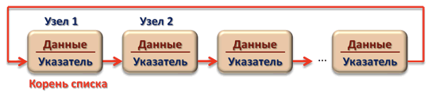
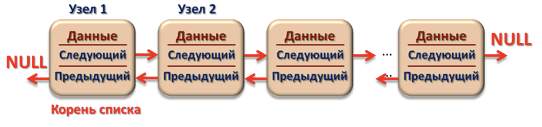
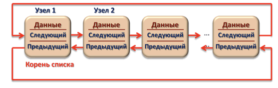

##Язык программирования C++ 

###Статические данные 
Память под данные выделяется либо на этапе компиляции 
(в этом случае необходимый объем должен быть известен до начала выполнения программы, 
то есть задан в виде константы), либо во время выполнения программы с по-мощью операции 
new или функции malloc (необходимый объем должен быть известен до распределения памяти). 
В обоих случаях выделяется непрерывный участок памяти.

###динамическими структурами данных
Если до начала работы с данными невозможно определить, сколько памя-ти 
потребуется для их хранения, память выделяется по мере необходимости 
от-дельными блоками, связанными друг с другом с помощью указателей.
К таким типам данных относятся:

1) Cписки(одно или двух связные)
2) Очереди
3) Бинарные деревья

Они различаются способами связи отдельных элементов и допустимыми операциями.
Динамическая структура может зани-мать несмежные участки оперативной памяти, в этом
заключается их преимущество, но чтобы получить или удалить эллемент из такой 
структуры данных, потребуется пройтись по всем эллементам до искомого.

Эллемент любой динамической структуры данных представляет из себя структуру `struct` 
содержащую по крайней мере два поля:

1) Сами данные, могут быть любым типом данных.
2) Указатель, на следующий или и на след-й и на превед-й эллемент.

##Расмотрим их
###Линейные списки
Спискимогут быть 4-х типов:

1) Односвязный список, где каждый эллемент хранить указатель на след-й эллемент списка, 
   но последний указывает на NULl
   
   
   

2) Односвязный список, где каждый эллемент хранить указатель на след-й эллемент списка,
   но последний указывает на первый эллемент списка

   
   
3) Двусвязный список, где каждый эллемент хранить указатель на следующий и на пре-щий
    эллемент списка, причем последний и первый ссылаются на NULL
  
   

4) Двусвязный список, где каждый эллемент хранить указатель на следующий и на пре-щий
   эллемент списка, причем последний ссылается на первый, а первый ссылается на последний

   

