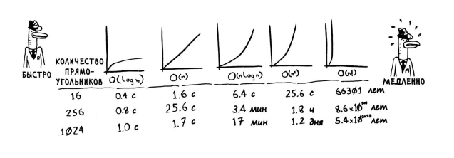

##Книга Грокаем Алгоритмы Бхаргава А.

Базовая алгебра, функции.

    f(x) = x * 2;
    f(5) = 10;

###1) Бинарный поиск
Алгоритм работает с отсортированным списком элементов, при поиске
искомого элемента, список делится по полам и сравнивается с элементом,
таким образом искомая область делится на двое при каждой итерации.

    Загадона: 57
    Список элементов: 100 
    
    [0...100]/2
    50<57
    [50...100]/2
    75>57
    [50...75]/2
    63>57
    [50...63]/2
    57==57 

С бинарным поиском мы каждый раз загадываем число в середине диапазона
и исключаем половину оставшихся чисел.

    100 -> 50 -> 25 -> 13 -> 7 -> 4 -> 2 -> 1
        1     2     3     4     5    6    7
    Максимальное количество шагов = 7

Тоесть за 7 шагом мы гарантированно найдем нужное значение их 100 
элементов.

Скорость этого алгоритма поиска полностью показывает себя с большими 
числами, сокращая их в два раза на каждом ходе, так дял нахождения 
нужного элемента из 240 000 потребуется всего 18 шагов.

Таким образом бинарный поиск выполняется за время равное log по
основанию 2 от числа n, где n - это количество искомых элементов.

Если 240 000 элементов проверяются по порядку то потребуется 240 000
проверок, такое время называется линейным временем поиска и время его
выполнения записывается как O(n) где n - количество элементов.

Время выполнения Бинарного поиска O(log n) тоесть время поиска равно
логарифму от числа по основанию 2.

Время выполнения алгоритмов может расти с разной скоростью.

Бинарный поиск: 1 миллиард просчитается за 30 шагов, если на каждый 
шаг уходит 1 мили сек то у  нас уйдет 30 мс. в то время как для поиска
из 100 элементов уйдет 7 мс, тоесть скорость работы алгоритма 
увеличивается в двое при каждой итерации.

Таким образом важно понимать что O большое описывает не прсото 
скорость работы алгоритма, скорость его ускорения.

O большое показывает скорость выполненияв худшем случае.

1) O(log n) - Логарифмическое время. Бинарный поиск. 
2) O(n) - Линейный поиск
3) O( n * log n) - Эффективные алгоритмы сортировки, в частности
Бвстрая сортировка.
4) O(n * n ) n в квадрате - Медленные алгоритмы сортировки, 
сортировка выбором.
5) O(n!) - Очень медленный алгоритм, факториал самый медленый.

Отображение выполнения на алгоритмов на графике.

