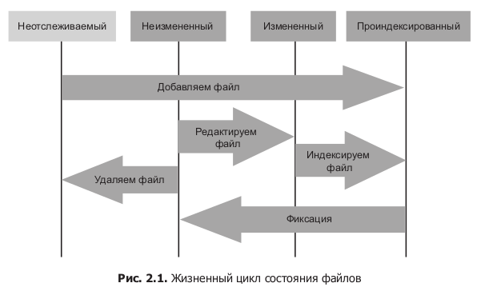

##Основы GIT
### Часть 1
Существует 2 способа создания проекта GIT:

1) Создать в папке GIT проект командой
    

    git init    

2) Создать репозиторий на GitHub и скачать его к себе, сдлеать это можно
как при помощи протокола HTTP:

    
    git clone <адрес репозиторяи>
    git clone <адрес репозиторяи> -b <название ветки>

Так и при помощи SHH:

    git:<URL>

### Часть 2
После первого клонироания с репы все фалы проекта становятся отслеживаемыми 
и не измененными, после того как мы меняем этот файл, его сотояние становится
измененным, далее мы индексируем эти файлы, и они становятся неизмененными.

###Проверка состояния файлов
Команда `git status` показывет состояние файлов, после клонирования мы 
можем получить такой результат. 

    $ git status
    On branch master
    nothing to commit, working directory clean

Это значит что мы находимся на ветке `master` и пока никаких изменений в файлы
сделано небыло. Если мы добавим в проект некий файл скажем `README` то после
этого команда `git status` покажет что в рабочей директории находится 
неотслеживаемый файл:

    $ git status
    On branch master
    Untracked files:
        (use "git add <file>..." to include in what will be committed)
            README
    nothing added to commit but untracked files present (use "git add" to track)

Это сообщение означает что есть новый файл, он неотслеживается, но его можно 
начать отслеживать добавив через команду `git add`

###Слежение за новыми файлами
Чтобы начать следить за файлом используется команда `git add`

    // отслеживание одного файла
    git add README

    $ git status
    On branch master
    Changes to be committed:
        (use "git reset HEAD <file>..." to unstage)
        new file: README

Эта команда покажет нам что, был добавлен новый файл с названием `README` и он
отслеживаемый и проиндексированный, все проиндексированные файлы перечисляются 
под заголовком `Changes to be committed` 

Теперь есть произвести фиксацию, то версия файла что была на момент исполнения 
`git add` попадет в историю сником состояния. 

Если мы создали новый файл, то он и неотслеживаемый и не проиндексированный.

    Changes to be committed

Если мы внеси изменения в уже сущетсвующий файл то он отслживаемы но не 
проиндексированный.

    Changed but not staged for commit

Индексирование производится командой `git add ...`

###Отмена Индексирования
Предположим что мы вспомнили что нам нужно чтото поменять в уже 
проиндексированном файле, мы открываем его и вносим изменения далее запускаем 

    git status
    
    On branch master

    Changes to be committed:
        (use "git reset HEAD <file>..." to unstage)
            new file: README
            modified: benchmarks.rb

    Changes not staged for commit:
        (use "git add <file>..." to update what will be committed)
        (use "git checkout -- <file>..." to discard changes in working directory)

            modified: benchmarks.rb

Видим видим что один и тотже файл находится сразу в 2 состояниях, одна его 
версия уже проиндексированна, а другая только отслеживается но не 
проиндексирвоанна. GIT в буквальном смысле делает снимок всего файла и в 
фиксацию попадет последняя проиндексированная версия снимка этого файла, а не
та версия что существует после внесения изсенения в файл. Для того чтобы
проиндексировать новое состояние этого файла, нам потребуется снова 
вызвать на исполнение команду `git add <файл>` после чего GIT заменить 
последнюю версию индексированного файла на новую.

Сокращенные версии команды `git status` выглядят так
`git status -s` или `git status --short`

