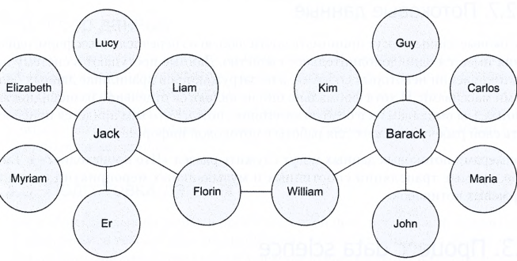
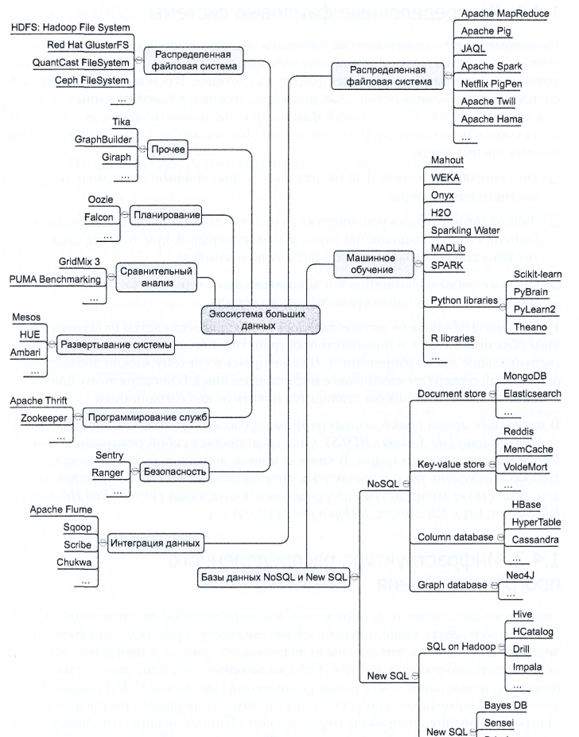

## Data Science
### Основы Data Science и Big Data. 
### Дэви Силена, Арно Мейсман, Мохамед Али.
Традиционным средством по работе с Большими Данными является СУБД.
Характеристики больших данных, отличающих их от обычных данных,
называют, четыремя V:

1) Volume - Обьем, сколько данных содержится.
2) Variety - Разнообразие, насколько данные различаются между собой.
3) Velocity - Скорость, с какой скоростью генерируются новые данные.
4) Veracity - Достоверность, насколько данные точны.

Data Science - это расширение статистики для работы с большими данными.

Сервивы персонализированной рекламы:
1) Google AdSense
2) MaxPoint

Открытый источник данных США:
1) https://www.data.gov

НПО - непровительственные организации.

MOOC - Massive Open Online Course - курс для Data Science.

### Различные Типы Данных
Существуют разные типы данных, каждый использует свои инструменты:
1) Структурированные
2) Неструктурированные
3) Естественный язык
4) Машинные
5) Графовые, Сетевые
6) Аудио, Видео
7) Потоковые

### 1 - Структурированные
Зависят от модели данных и хранятся в фиксированных полях, тоесть просто
в таблицах, в Бд или в файлах Excel. Здесь SQL является основным способом
работы с данными. 

### 2 - Неструктурированные
Их трудно подогнать под конкретную модель данных, их соднржимое имеет
имеет переменный характер, примером такого типа может быть обычная почта.
Сам текст почты тоже может быть примером данных на естественном языке.

### 3 - Данные на естественном языке
Данные на языке сложно обрабатывать, сильно зависит от контекста, и 
является особой разновидностью данных.

### 4 - Машинные
Данные что автоматически генерируются программами, без вмешательства 
человека. Это один из основных источников данных, к ним относится 
журналы веб-серверов, записи звонков,урналы сетевых событий.
Машинные данные хорошо подходят под структуруированные данные.

### 5 - Графовые или Сетевые данные
В виде графов можно представить любые данные, тут имеется в виду 
графы из математической теории графов, а именно моделирование 
попарных отношений между обьектами. 

Графовые данные это типичные социальные сети, а взаимодействие с ними
позволяет вычислять такие специфичные свойства как кратчайший путь
между двумя людьми.

Примерами могут служить, LinkedIn, список читателей в Twitter.

Главная суть связанных данных проявляется в анализе нескольких 
пересекающихся граафов, а именно наложение нескольких графов из разных
сфер деятельности друг с другом.

Для храниения графовых данных используют специальные Базы Данных для
графов, а для построения запросов используют спец-ный язык запросов
**SPARQL**

### 6 - Аудио, Видео, графика
Это сложная задача для анализа, тривиальные задачи для человека 
оказываются сложными для компьютера, для обучения тут используются 
такие проуессы как `глубокое обучение`.

### 7 - Потоковые данные
Могут принимать любой из перечисленных ранее типов данных, но у них 
есть еще одно дополнительное свойство, такие данные приходят в результате
некотрых событий как вебхук, не загружабтся в БД целым массивом.

К нему относятся: прямые трансляции, музыкальные мероприятия, данные 
биржевых котировок, раздел что сейчас происходит в соц сетях.

### Процесс Data Science 
Задачи при работе в этой отрасли следующие:
1) Назначение цели иследования
2) Сбор данных
3) Подготовка данных
4) Иследование данных
5) Моделирование данных
6) Отображение и автоматизация

### 1 - Назначение цели иследования
DS решает бизнес задачи, первый шаг это подготовка задания, а задании 
описывается что собираемся иследовать, какую пользц это принесет 
компании, какие данные и ресурсы потребуются, календарный план, и 
описание выходных результатов.

### 2 - Сбор данных
Проверка существования качества и доступности данных, от Excel до БД.

### 3 - Подготовка данных
С начала начинается процесс `очистки данных`, удаляем некоректные 
значения,  и устраняем расхождения между разными источниками данных.
`Интеграция данных` расширяем информация по средствам обьеденения данных
из нескольких источников. `Преобразование данных` преобразуем данные
в подходящий формат, для последующего использования в Моделях.

### 4 - Иследование данных
Процесс нахождения взаимосвязей и корреляции между данными, оценить
распределениее данных и определить наличие выбросов, для этого 
используется описательная статистика, визуальные методы и простое 
моделирование.

Этот шаг обозначается как EDA - Exploratory
Data Analysis (Иследовательский анализ данных)

### 5 - Моделирование данных
Моделирование информации о данных, полученных на превыдущем этапе, 
для моделирования используются методы статистики, машинного обучения,
иследования операций. Тут выбираются переменные для модели и проводится 
ее диагностика. 

### 6 - Отображение и автоматизация
После иследования результат должен быть предоставлен Бизнес-стороне 
в подходящем виде, это презентации и отчеты.

### Итеративный процесс
Иногда будет требоваться возвращаться к превыдущим шагам, и повторять
процес.

### Экосистема больших данных
Существует множество инструментов по работе с данными, все они делятся 
на группы, рассмотрим различные группы инструментов:

### Инфр-ра Распределенная файловая система
Как обычная файловая система но работает на нескольких серверах сразу,
они могут хранить данные превышающие размер жесткого диска.

Самой популярной является Hadoop File System от Google.

### Инфр-ра Машинное обучения

1) Scikit-learn - машинное обучение
2) PyBrain - для нейронных сетей
3) NLTK - обработка текста
4) Pylearn2 - машинное обучение
5) TensorFlow - глубокое обучениеот Google

### Инфр-ра БД
Сюда входят стандартные реляц-е БД, и NoSQL решения, графовые БД.

