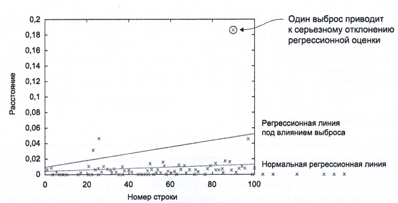
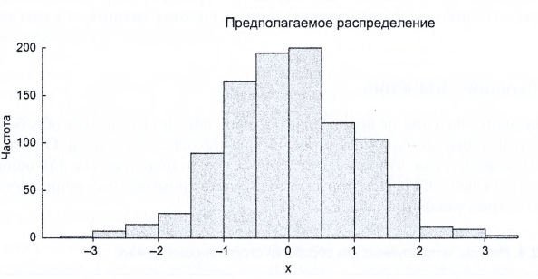
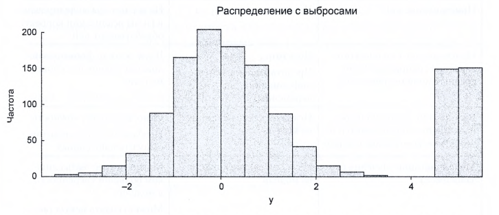
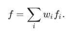

## Data Science
Большая часть времени работы уходит на проверку качества данных, также
требуется привести данные к стандартному виду, избавить от опечаток, и
пустых значений. Следует привести данные к одному типу, избавится от 
лишних пропусков, разнве еденицы измерения и тд...

Иногда для поиска и выявления ошибок используют метод простого 
моделированияб, к прримеру проводят линейную регрессию, с помощью 
которой находят основное поведение функции, и в случае если какойто
отдельный результат сильно отклоняется от сновной линии, то это может
быть прсото аномалия в данных, такой способ может выступать в качестве 
прйостейшего фильтра для данных.

Как можно увидеть на рисунке, под влиянием одной точки на графике, 
вся функция искажает свое поведение.

### Выбросы outlier
Это результат наблюдений, сильно отличающийся от других результатов, 
собственно то что и можно увидеть при построении простой модели при помощи 
линейной регресии.

Один из способов поиска таких отклонений является построение диаграмм или
таблиц с минимальными и максимальными значениями. 

## Немного а Линейной Регрессии
#### Интерполяция.
Интерполяция - выбор функции которая проходит через заданные точки.

Примерами могут являться:
1) Интерполяция полиномами Лагранжа
2) Метод ближайших соседей
3) Многомерная интерполяция, билинейная, трилинейная

#### Экстраполяции.
Экстраполяции — предсказание поведения функции вне интервала. 
Например, предсказание курса доллара на основании предыдущих 
колебаний — экстраполяция.

#### Аппроксимация.
Аппроксимация - Способ выбора из простых функция ту, что будет 
приближена к сложной функции, и не будет превышать определенного предела. 

Примером может служить:
1) Ряды Тейлора на отрезке
2) Апроксимацию ортоганальными многочленами
3) Апроксимацию Паде
4) Апроксимация Синуса Бхаскара

### Функция потерь, ошибки. loss/cost function
Функция потерь - функция которая в теории статистических решений 
характеризует потери при неправильном принятии решений.

### Регрессия
Регрессия - способ выбрать из семейства функций ту, которая минимизирует 
функцию потерь. В ходе экспеременат функция неизбежно содержит ошибки, 
так назывемый шум, по этому нас интересует общая тенденция поведения 
функции, а не точно проходила через всем точки.

Регрессия - это `интерполирующая аппроксимация`, наша цель провести 
функцию как можно ближе к точкам, но при этом сделать это максимально 
просто, для сохранения общей тенденции.

### Линейная регрессия. Linear regression
Используемая в статистике регрессионная модель зависимости одной
переменной от других переменных.

Цель найти коэффициенты этой линейной комбинации функции f. Линейной ее 
называют из за линейной комбинации базисных функций. 

### Разные мелочи:
"Мусор на входе - мусор на выходе"

"Несколько простых моделей лучше чем одна большая"

Курс от Yandex - https://praktikum.yandex.ru/data-scientist/?utm_source=yandex&utm_medium=cpc&utm_campaign=Yandex_Search_Data-scientist_Obuchenie&utm_content=9324310171&utm_term=---autotargeting&yclid=18107046727319333362

Data.gov - Отк данные США

open-data.europa.eu - тк данные Еврокомиссии

Freebase.org - Отк БД разных источников, википедия

Data.worldbank.org - Отк данные Всемирного Банка

Aiddata.org - Отк данные в обл международного развития

Open.fda.gov - Отк данные Администрации США по пищевым 
продуктам и лекарствам

