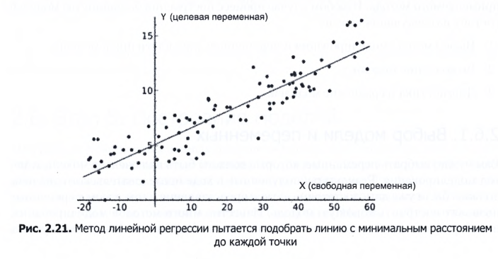
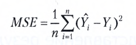

## Модели
В Python уже существуют библиотеки для реализации моделей, такие как:

1) StatsModels
2) Scikit-Learn

К примеру построение модели для линейной регрессии, при помощи библиотек:

Для оценки степени соответствия используется `коофициент детерминации 
(R-квадрат)` или `скорректированный коофициент детерминации`.
Эта метрика отображает степень разброса данных, 

### Сравнение Моделей
Контрольная выборка - это выбор лучшей модели из тех что были построены
при обработке данных, принцып просто, модель должна работать для 
незнакомых данных. Вычисляется метрика погрешности, существует множество
таких метрик, одна из которых это `среднеквадратичная погрешность`

Cреднеквадратичная погрешность

Суть ее такова - для каждого прогноза проверяется его отклонение от 
истинного значения,тклонение возводится в квадрат, а погрешности всех 
прогнозов сумируются.

Как это работает: Есть 1000 заказов, из них в обучении модели учавствует 
только 80% тоетсь 800. Далее мы строим 2 модели для прогнозирования 
будущего размера товара в зависимости от его цены, и на основании 2 
моделей, нас получется 2 прогноза, а после этого мы смотрим на сколько
те самые 20% отличаются от прогноза, после чего все погрешности 
сумируются и из них выбирается та модель у которой меньше погрешность.

    Первая модель `size = 3 * price`
    Погрешность первой модели = 5861

    Вторая модель `size = 10`
    Погрешность второй модели = 110225

Страница 72

