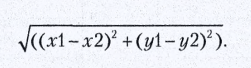

## Евклидово расстояние
Обычное прямое растоние по прямой, в системе координат абсцисс и ординат.
По сути это выстраивание обычного прямоугоьника и нахождение длинны
гипотенузы при помощи теоремы пифагора.

Евклидово расстояние является расширением одной из теорем тригонометрии, 
теоремы Пифагора, теорема пифагора гласит что длинна третьей стороны
прямоугольного треугольника равна корню суммы квадратов эти двух катетов.

Евклидово расстояние между 2 точками на плоскости вычисляется по схожей 
формуле:

