##SQL Урок 7 

ambiguous - двусмысленный
grinning - Ухмыляющийся
grinned  - Ухмылялся 

По мимо самих JOIN можно делать обьеденения при помощи обычного WHERE.
По сути это есть не что иное как INNER JOIN, это еще называется
Декартово произведенеи - все строки одной таблицы устанавливают связи
со всеми строками другой таблицы, при запрсое формируется временная таблица
в которой каждой записи из одной таблицы, сопоставлена каждая строка другой
таблицы. А после мы изымаем из этой таблицы данные что по некому полю имеют
связь.

    SELECT vend_name, prod_name, prod_price
    FROM Vendors, Products
    WHERE Vendors.vend_id = Products.vend_id;

Однако тут будет выдана ошибка в случае если, у обоих таблиц есть 2 
поля с одинаковым названием.

###Обьединение таблиц INNER/LEFT/RIGHT/FULL JOIN
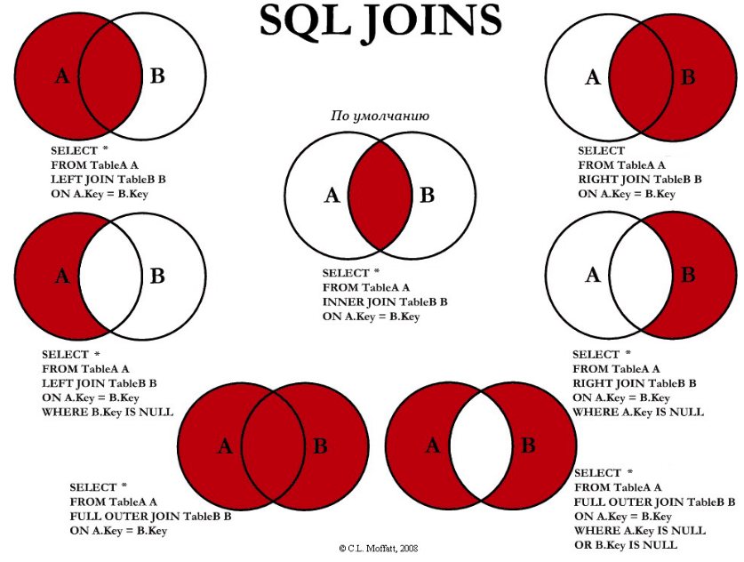

#### INNER JOIN
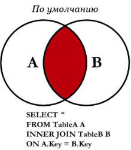

Стандартный JOIN выбирает данные что по некотрому полю пересекаются
из обеих таблиц, этот оператор срабатывает по умолчанию если пишим просто
слово JOIN.

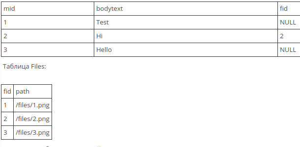

    SELECT * 
    FROM Messages 
    INNER JOIN Files ON Messages.fid = Files.fid

Этот запрсо создает таблицу которая будет состоять из данных у которых есть 
связь в обоих таблицах. Видим что в табл Messages есть только одно поле id = 2 
которое также присутствует в таблице Files таким образом мы получаем одну
записть:

    mid	  | bodytext  | fid	 |  path
    ---------------------------------------
    2	  | Hi	      | 2  	 |  /files/2.png

Тоетсь там где в таблицах записи совпадают по полю fid и происходит 
выборка данных.

#### LEFT JOIN 
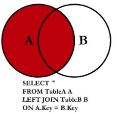

При левом обьеденении мы выводим все записи что етсь в левой таблицы, в данном
случае это Messages, и в том числе и те записи в которых значение fid есть в 
таблицу Files.

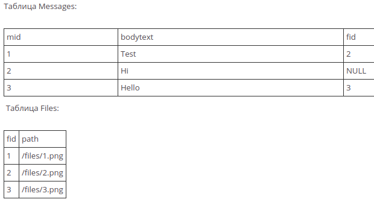

    SELECT * 
    FROM Messages
    LEFT JOIN Files ON Messages.fid = Files.fid

В результате получим все записи из левой таблицы, с обьеденением
записей из правйо таблицы,сли для данных из левой нету 
соответствующих записей из правйо таблицы, то они заполняются `NULL`

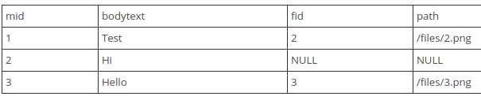

#### LEFT JOIN без пересечения с левой таблицей

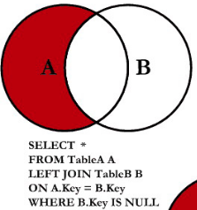

Запрос подобного типа выводит все записи из левой таблицы у которых
нету пересечения с правой таблицей по указанному полю. Тоесть 
получаем данные из левой таблицы что по полностью неимеют связей 
с правой таблицей по связуюему полю.

Видим что в левой таблице у поля с id = 2 у которого поле 
fid = NULL. Нету соответствующей записи в правой таблице, так
что именно эту запись мы и получим.

    SELECT * 
    FROM Messages AS ms
    LEFT JOIN Files AS fl ON ms.fid = fl.fid
    WHERE fl.fid IS NULL;

Получи все записи из левой таблицы у которых нету прикрепленных
файлов.

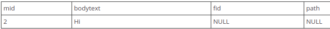

#### RIGHT JOIN

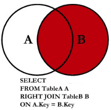

Выводит все записи из правой таблицы, и если есть связанные 
данные из левой таблицы, если этой связи нету то заполняет NULL

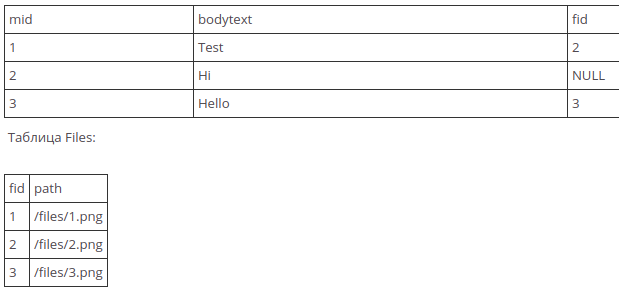

    SEELECT * 
    FROM Messages AS ms
    RIGHT JOIN File AS fl 
    ON ms.fid = fl.fid;

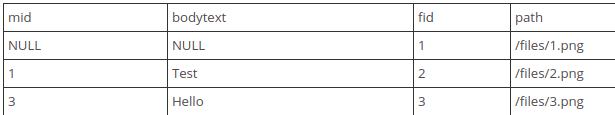

#### RIGHT JOIN без пересечений

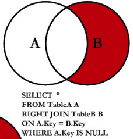

Выводит все записи из правой таблицы у которых нету связи 
с левой таблицей.

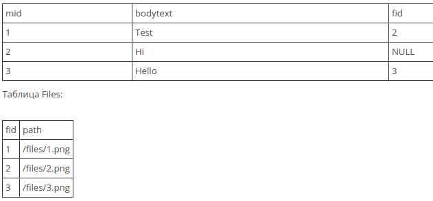

    SELECT *
    FROM Message AS ms
    RIGHT JOIN File AS fl
    ON ms.fid = fl.fid
    WHERE ms IS NULL;

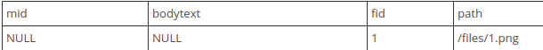

#### FULL OUTER JOIN

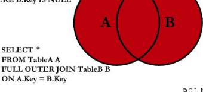

В MySQL такой функции нету, но его можно имитировать при помощи
запроса типа `UNION`

В целом это как сделать Левое и Правое обьеденение.

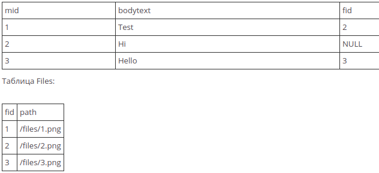

    // Первый запрос
    SELECT *
    FROM Message AS ms
    FULL OUTER JOIN File AS fl
    ON ms.fid = fl.fid;

    // Второй запрос
    SELECT * 
    FROM Messages LEFT JOIN Files ON Messages.fid = Files.fid
    UNION
    SELECT * 
    FROM Messages RIGHT JOIN Files ON Messages.fid = Files.fid

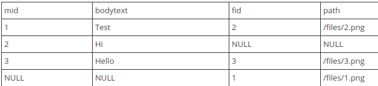

#### FULL OUTER JOIN без пересечений

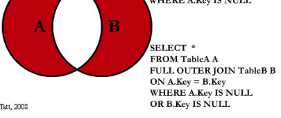

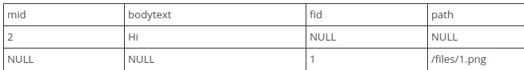

