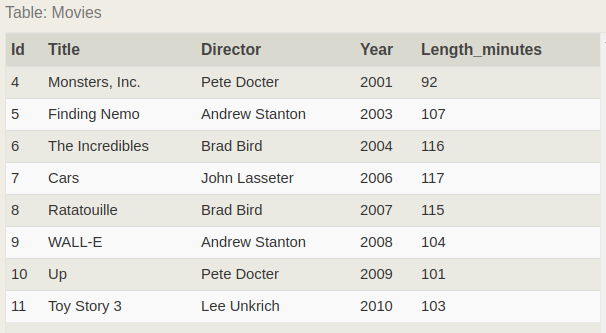
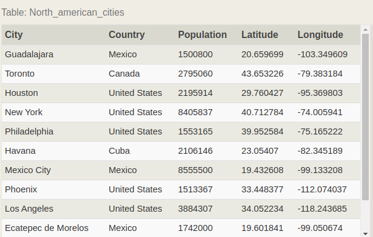
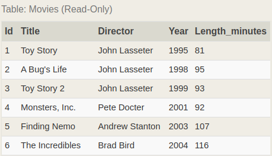
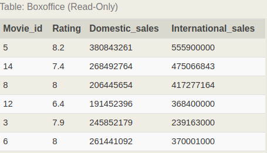
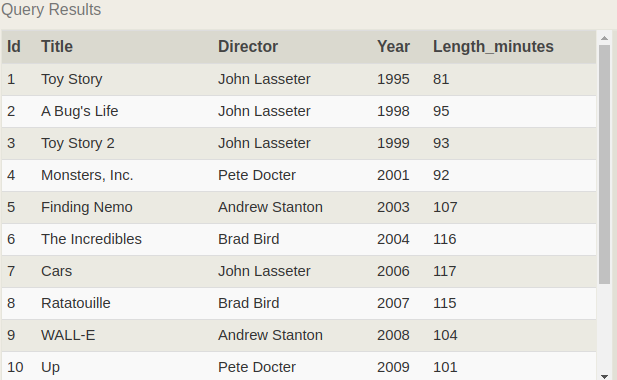

###SQL Урок 8 по материалам сайта https://sqlbolt.com/
Примеры SQL запросов.

alphabetically - в алфовитном порядке
domestic  - внутренний домашний в нутри страны
international - в мире интернациональный
descending order - порядке убывания

У нас есть таблиуа вида:

1.Find the movies released in the years between 2000 and 2010

    SELECT * 
    FROM movies
    WHERE year BETWEEN '2000' AND '2010';

2.Find the movies not released in the years between 2000 and 2010

    SELECT * 
    FROM movies
    WHERE year NOT BETWEEN '2000' AND '2010';

3.Find the first 5 Pixar movies

    SELECT * FROM movies LIMIT 5;

4.Find all the Toy Story movies

    SELECT * 
    FROM movies
    WHERE title LIKE('Toy Story%');

    /// Ответ
    1	Toy Story	John Lasseter	1995	81
    3	Toy Story 2	John Lasseter	1999	93
    11	Toy Story 3	Lee Unkrich	2010	103

5.Find all the movies directed by John Lasseter

    SELECT *
    FROM movies
    WHERE director = 'John Lasseter';

6.Find all the movies (and director) not directed by John Lasseter

    SELECT * 
    FROM movies
    WHERE director != 'John Lasseter';

7.Find all the WALL-* movies

    SELECT * 
    FROM movies
    WHERE title LIKE('WALL-%');

8.List all directors of Pixar movies (alphabetically), without duplicates

    SELECT DISTINCT director
    FROM movies
    ORDER BY director ASC;

9.List the last four Pixar movies released (ordered from most recent to least)

Инструкция LIMIT опциональна и является частью конструкции ORDER BY тоесть
мы выбрали все до единой записи из таблицы, отсортировали ее в противоположном 
порядке, и просто выбираем из них первые 4, которые по итогу являются последними 
4 записями из первоначальной таблицы.

    SELECT title, year 
    FROM movies
    ORDER BY year DESC
    LIMIT 4;

10.List the first five Pixar movies sorted alphabetically

    SELECT *
    FROM movies
    ORDER BY title
    LIMIT 5;

11.List the next five Pixar movies sorted alphabetically

    SELECT * 
    FROM movies
    ORDER BY title
    LIMIT 5 OFFSET 5;

###Новая таблица, города Северной Америки.

12.List all the Canadian cities and their populations

    SELECT * FROM
    north_american_cities
    WHERE country = 'Canada';

13.Order all the cities in the United States by their latitude from north to south

    SELECT * 
    FROM north_american_cities
    WHERE country = 'United States'
    ORDER BY latitude DESC;

    City	 Country	Population	 Latitude	Longitude
    Chicago	 United States	2718782	41.878114	-87.629798
    New York	United States	8405837	40.712784	-74.005941
    Philadelphia	United States	1553165	39.952584	-75.165222
    Los Angeles	United States	3884307	34.052234	-118.243685
    Phoenix	United States	1513367	33.448377	-112.074037
    Houston	United States	2195914	29.760427	-95.369803

14.List all the cities west of Chicago, ordered from west to east

    SELECT city, longitude FROM north_american_cities
    WHERE longitude < -87.629798
    ORDER BY longitude ASC;

    
15.List the two largest cities in Mexico (by population)

    SELECT city, population FROM north_american_cities
    WHERE country LIKE "Mexico"
    ORDER BY population DESC
    LIMIT 2;

16.List the third and fourth largest cities (by population) 
in the United States and their population.

Вывести из городов Америки 3 и 4 по уровню популяции города

    SELECT *
    FROM north_american_cities
    WHERE country = 'United States'
    ORDER BY population DESC
    LIMIT 2, 2;

###Работа с INNER JOIN

Форма записи для INNER JOIN:

    Выберите запрос с INNER JOIN для нескольких таблиц
    SELECT column, another_table_column, …
    FROM mytable
    INNER JOIN another_table
    ON mytable.id = another_table.id
    WHERE condition(s)
    ORDER BY column, … ASC/DESC
    LIMIT num_limit OFFSET num_offset;

Фильмы

Продажи фильмов

Рузультирующая таблица

1.Find the domestic and international sales for each movie

    SELECT mv.id, mv.title, bx.domestic_sales ,bx.International_sales
    FROM movies AS mv
    INNER JOIN boxoffice AS bx ON mv.id = bx.movie_id;
    

2.Show the sales numbers for each movie
that did better internationally rather than domestically

    SELECT mv.id, mv.title, 
    bx.domestic_sales ,bx.International_sales
    FROM movies AS mv
    INNER JOIN boxoffice AS bx ON mv.id = bx.movie_id
    WHERE bx.International_sales > bx.domestic_sales;

3.List all the movies by their ratings in descending order

    SELECT mv.*, bx.Rating
    FROM movies AS mv
    INNER JOIN boxoffice AS bx ON mv.id = bx.movie_id
    ORDER BY bx.Rating DESC;

###Работа с INNER/LEFT/RIGHT/FULL JOIN

