##Графическая форма представления алгоритмов

Разберем стандартизированные схемы алгоритмов: 

###Процесс (вычисление)
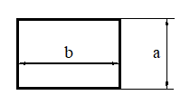

###Проверка условия
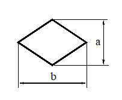

###Подпрограмма
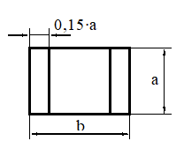

###Ввод-вывод
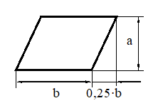

###Соединительные линии

###Начало цикла с параметром
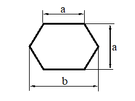

###Начало и конец (Пуск и останов)
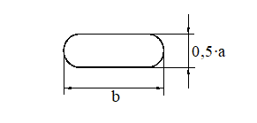

###Комментарий
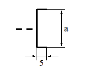

###Внутристраничный соединитель
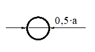

###Межстраничный разделитель
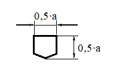

###Примеры

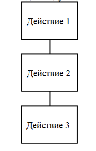
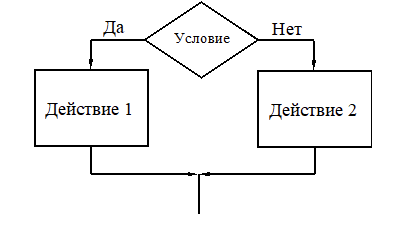
