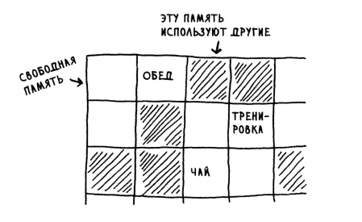
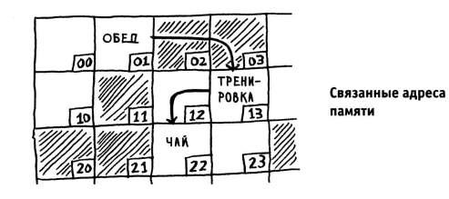

##Работа Памяти, Массивы/Списки и Сортировка Выбором
###Как работает память
Память в ПК работает как как большой ящик, с адресованными ячейками
памяти. feOffeeb - адрес ячейки памяти. Именно такие ячейки памяти 
выделяются в языке С++ при обьявлении переменных, но до присвоения
им какого либо значения. оесть в ячейке памяти находится всякий мусор.

###Массивы и связанные списки
Для сохранения некотрого колличества связанных между собой элементов,
используется либо списки либо массивы.

##Массивы
Массивы - при сохранении массивов все элементы массива записываются 
в памяти один ха другим непосредственно, прямо в соседних ячейках 
памяти.

Но при желании добавить еще один элемент в массив, мы встречаемся с 
проблемой, следующей ячейке уже лежат другие значения, встречая 
такую ситуацию компьютер ищет другое место в памяти, где есть
нужное количество незанятых ячеек памяти, и после этого полность
переносит весь массив с добавлением новых значений в этот блок 
памяти.

Таким образом добавление элементов в массив сильно замедляет работу,
в таких языках как PHP, JavaScript, Python в которых есть 
динамические массивы, все так и работает. Такие языки как С++ 
имеют как динамические массивы так и статические, со строго 
фиксированным количеством мест в массиве, что позволяет не перемещать
массив при добавлении нового элемента, но ограничивают работу, от 
использования динамических массивов никуда не уйти, они необходимы.

Нельзя просто забронировать 10 мест под массив, если в массив попадет 
всего 3 элемента то остальные не будут исп эфективно, а если 
потребуется вставить более 10 элементов, перемещать всеравно предется.

Для решения этой проблемы используется не массивы а списки.

##Списки
Списки - При использовании списков, элементы могут размещаться где 
угодно в памяти, 

Таким образом решается проблема хранения и добавления элементов,
но возникает вопрос как связать эти элементы воедино, так чтобы
мы знали что данные лежащие в совершенно разных местах памяти 
обьеденены в единый список.

Это решается тем что все эти жлементы связываются ссылками, каждый
элемент из списка хранит в себе по мимо самих своих данных еще и 
ссылку на адрес в памяти хранения другова элемента.

Таким образом мы получаем цепочку элементов, называемых связанным
списком.

###Поиск в Массиве/Списке
Массивы хоть и не могут удобно добавлять данные, но благодаря тому 
что мы знаем место хранения каждого элемента в массиве, мы способны 
быстро получать любой нужный произвольный элемент в массиве в любой
момент,то преимущество массивов.

В списках мы не можем получить нужный произвольный элемент сразуже
нам приходится последовательно пройтись по всем элементам списка,
чтобы дойти до нужного. Списки легко вставляю данные но плохо их 
изымают из памяти, использовать списки следует в случаях когда 
требуется последовательной пройтись по всем элементам списка.

Таким образом получаем следующую картину.

###Вставка в Массив/Список
Предположим что мы хотим вставить в Массив новый жлемент и вставить 
его в середину массива, таким образом нам предется сдвинуть все 
элементы идущие после той позиции в которую мы вставляем значение.

При вставке элемента в список, мы прсото сдвигаем указатель, 
так образ это происходит быстро и легко.

###Удаление элемента в Массиве/Списке
Тут в отношении со списками все также, массивами почти также,
при вставке в массив мы не прпосто сдвигаем все оостальные жлементы
но и при недостатке места, преносим весь массив, при удалении же мы 
просто сдвигаем все элементы с той позиции в которую вставляем
элемент.

