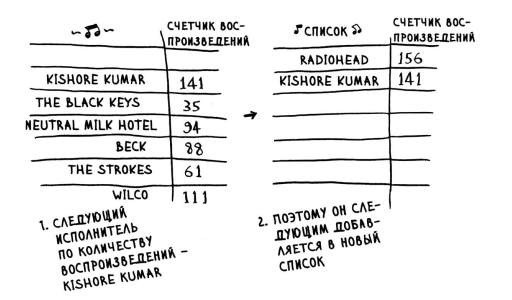

###Сортировка Выбором
Допустим есть массив состоящий из неотсортированных однородных 
элементов.

    156
    141
    25
    94
    .
    .
    .
    61
    111

Наша задача отсортировать элементы по убыванию, решение, пройтись 
пройтись по списку и найти самое большое значение, и добавить его в 
новый список, после удаляем его из изначального списка сокаращая его
на один элемент, далее повторяем процесс.

Чтобы проверить каждый элемент в списке требуется пройтись по всем 
элементам списка, тоесть время прохода по всем элементам равно O(n)

Также мы проходим каждым элементом по всем элементам так образ
получаем время работы O( n * n ) или O большое от n в квадрате.

Из за того что при каждой итерации мы удаляем один выбранныей 
элемент, то после каждой итерации массив сокращается на 1 число,
так что былобы вернее записать этот алгоритм следующим образом.

    n-1, n-2, n-3 . . . 2, 1

В среднем проверяется список из 1/2 * n элементов. Так что должно 
было получиться O( n * 1/2 * n) но в подсчете O большого такие 
остатки как 1/2 игнорируются, почему ? будет расмотрено ниже.

Этот Алгоритм сортировки O(n * n) считается медленным.

