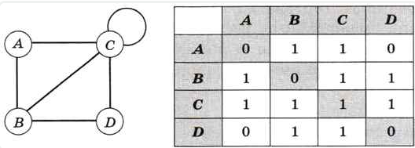
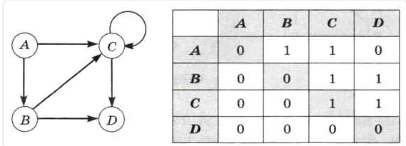
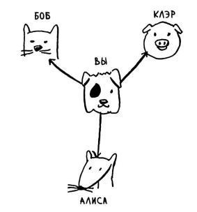
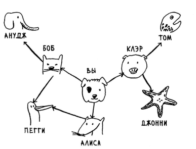
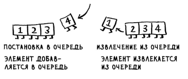
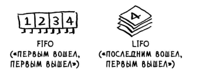
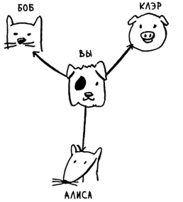
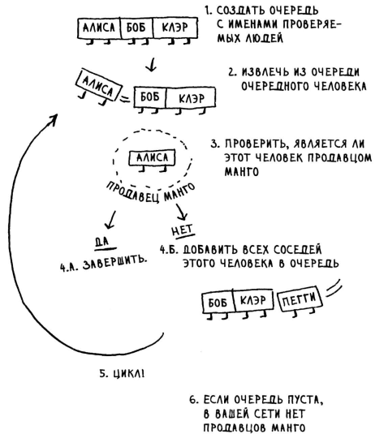
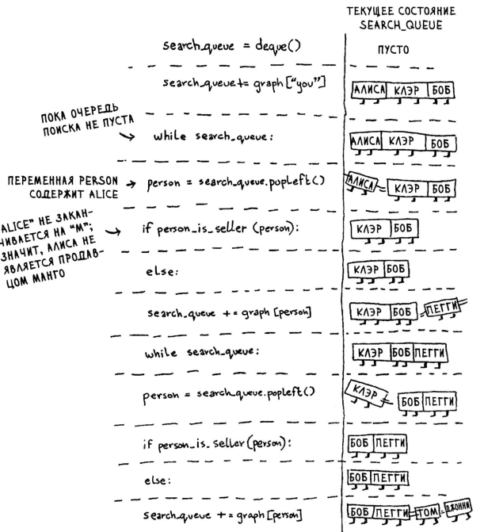
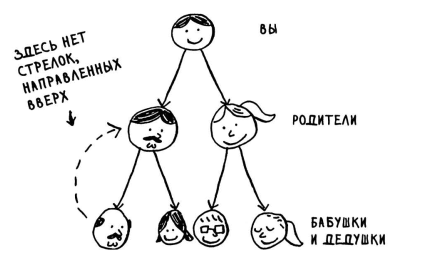

## Графы, Поиск в ширину, Топологическая сортировка.
Самые полезные алгоритмы, это алгоритмы по работе с графами, и эти 
задачи самые частые на реальной практике.

Граф - это набор узлов(вершин) и связей между ними (рёбер). Информацию 
об узлах и связях графа обычно хранят в виде таблицы специального вида
их называют `матрицы смежности`.

Матрица смежности - это специальная таблица показывающая связи и отношения
одних узлов с другими узлами, где отношение узла к самому себе всегда равно
нулю. Если два узла соеденены между собой ребром, то их связь равно еденице,
столбцы и строки равны узлам. Матрица смежности симметрична относительно 
главной диагонали.

По мимо ребер что идут от одного узла к другому, есть еще ребра что начинаются 
и заканчиваются в тойже вершине, в таком случае на диагонале подобной матрицы
смежности будет равна = 1.

### Поиск в ширину.
Поиск в ширину это тоже алгоритм поиска, но работает с граыами, основная задача
этого алгоритма, ответить на 2 вопроса:

1) Существует ли путь от узла А к узлу В
2) Как выглядит кратчайший путь от узла А к узлу В

Представим себе что у нас есть граф, и мы начинаем поиск с центрального узла, 
начинаем проверять все соседние узлы, узлы что находятся непосредственно рядом
от начальной точки, называются узлами первого уровня. Таким образом мы обходим
каждый из узлов в поиске нужного, если не находи его,о включаем в список для 
последующей проверки все соседнии узлы с тем уоторый не подошел.

Таким образом наш список из узлов которые требуется проверить в поиске нужного
постоянно растет, мы будем искать нужный ужел постоянно расширяясь во все стороны
в поисков нужного.

Проверка должна происходить по очереди, от связей первго уровня к связям второго
уровня, и так далее ... до тех пор пока свзяи первого уровня не будут полностью 
проверены, нельзя переходить к связям второго уровня.

Для реализации подобного поиска в существует специальная структура данных,
называется `Очереди`.

### Структура данных - Очереди.
Очереди как и списки/стеки не дают возможности произвольного доступа к своим 
элементам.

Поддерживается 2 типа операций:

1) Постановка в очередь
2) Извлечение из очереди

При постановке в очередь некого элемента, первый поставленный элемент, будет
первым и извлечен, последний поставленный элемент будет извлечен последним.
В плане работы с извлечением элементов, очереди являются полной 
противоположностью стеков, где последний поставленный первым же и уходит.

Очереди - FIFO - First In, First Out - Первый пришел, первый вышел
Стеки   - LIFO - Last In, First Out  - Последний пришел,ервый вышел

### Реализация графа
Как мы помним из Хеш-таблиц, ключ связывается со значением, и по ключу 
можно найти значение, тоесть эта реализация ассоциативного массива или 
так называемого словаря в Python.

Реализуем связи графов в виде словаря, где ключом будет выступать текущий
узел, а его значениями будут выступать, ближайшие его соседи первого уровня.

Поучаем словарь следующего вида, для начальной точки и его связей первого 
уровня:

    graph = {}
    graph["you"] = ["alice", "bob", "claire"]

Расширенный граф в виде словаря, с 2-мя уровнями связей:

    graph = {}

    // Начальная точка
    graph["you"] = ["alice", "bob", "claire"]

    // Узлы первого уровня
    graph["bob"] = ["anuji", "peggy"]
    graph["alice"] = ["peggy"]
    graph["claire"] = ["thom", "jonny"]

    // Узлы второго уровня
    graph["anuji"] = []
    graph["peggy"] = []
    graph["thom"] = []
    graph["jonny"] = []

Реализация алгоритма поиска:

В Python я реализации очереди используется модуль(библиотека) `deque`

    from collections import deque

    // Создаем очередь и добавляем в нее первый узел 
    // с которого и начинается поиск в графе
    serach_deque = deque()
    serach_deque += graph["you"]

    while serach_deque:
        person = serach_deque.popleft()
        if person_is_seller(person):
            return True
        else:
            serach_deque += graph[person]
    return False

    def person_is_seller(name):
        return name[-1] == 'm'

Суть работы алгоритма такова:

1) Вносим в очередь первый элемент, который представляет из себя словарь со 
   списком. Это наш первый узел.
   
2) В цикле проходимся по каждому элементу в списке первого узла, м вызываем
   для него нашу функцию проверки, если функция проверки возвращает нам True
   то цикл завершен, если нет то добавляем в нашу очередь еще один элемент,
   который в свою очередь тоже представляет из себя список, который будет 
   тоже проверен в свою очередь.

3) Если функция проверки не сработала ни разу, то значит среди искомых узлов 
   нету того, который нам нужен.
   

Однако у 2 узлов есть сосед и это `peggy` тоесть один и тотжу узел будет 
добавлен в очередь, на проверку дважды, делать этого не нужно, для этого
будем вести список уже проверенных узлов, и если он был проверен раз, то в 
очередь болше добавлять его не будем.

Окончательный вариант Алгоритма, поиска в ширину:

    from collections import deque

    def search(name):
       serach_deque = deque()
       serach_deque += graph[name]
       searched = []

       while serach_deque:
           person = serach_deque.popleft()
           if not person in searched:
              if person_is_seller(person):
                  return True
              else:
                  serach_deque += graph[person]
                  searched.append(person)
       return False

    def person_is_seller(name):
        return name[-1] == 'm'

    search("you")

Тут мы просто добавляем массив, в котором будем помечать все уже проверенные 
узлы, и если узел уже был проверен, и проверку не прошел, то помечаем его.

### Время выполнения Алгоритма Поиска в ширину
V - Количество узлов
E - Количество ребер

O(V+E)

Такая ращзновидность графа в котором нету ребер указывающих в обратном напрвылении
называется деревом:

 

