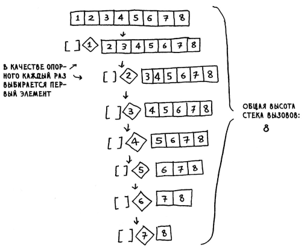
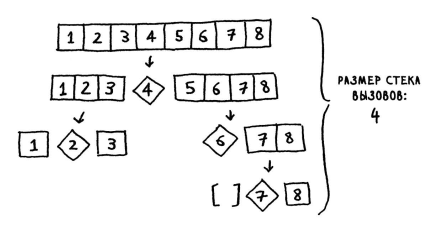
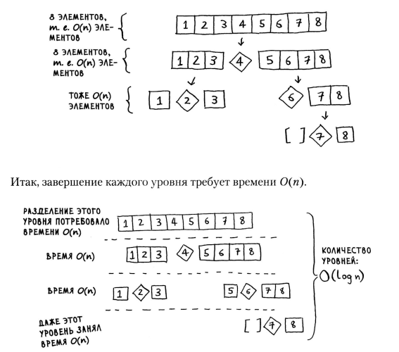

## Алгоритмы, Быстрая сортировка, от O(n*n) до O(n * log n)

    def summ(array):
        if len(array) == 1:
            return array.pop(0)
        else:
            return array.pop(0) + summ(array)
    
    array = [2, 4, 6]
    result = summ(array)
    print(result)

Быстрая сортировка использует метод "разделяй и властвуй". Этот алгоритм
работает быстрее сортировки выбором. 

### Быстрая сортировка
Относится к алгоритму сортировки массивов, и выполняется намного быстрее
сортировки выбором, применяется в реальных программах, во многих языках
программирования есть функция на подобии `qsort()` что и реализует
быструю сортировку.

Быстрая сортировка(БС) основана на рекурсии, и рабеоте со стеком вызовов.

Базовый случай для БС это либо уже отсутствие в массиве значений, тоесть
массив уже пуст, либо когда в массиве содержится всего 1 оставшийся эллемент.
На основе этого базового случая, когда в массиве уже меньше 2 эллементов,
мы его возвращаем как базовый случай.

    def qsort(array):
        if len(array) < 2:
            return array

### Код быстрой сортировки 

    def quicksort(array):
    if len(array) < 2:
        return array
    else:
        pivot = array[0]
        less = [i for i in array[1:] if i <= pivot]
        grester = [i for i in array[1:] if i > pivot]
        return quicksort(less) + [pivot] + quicksort(grester)

    array = [10, 5, 2, 3]
    result = quicksort(array)
    print(result)
    
Суть быстрой сортировки это обход массива при помощи рекурсии, разделение
массива по разделителю на 2 массива, и далее такойже обход рекурсивной 
функцией по каждому из подмассивов.

### Скорость работы
Быстрая сортировка уникальна тем что скорость ее работы, зависит не только
от самого Алгоритма и размера массива, но и от того какой эллемент будет 
выбран в качестве опорного.

Бвстрая сортировка выполняется за время зависящие от выбора разделителя, 
от `O(n * lon n)`(лучшем случайе) и  `O(n * n)`(в среднем).

Существет еще сортировка слиянием, время выполнения которой всегда `O(n * log n)`
тогда возникает вопрос если сорт слиянием всегды выполняется `O(n * log n)` в то 
время как у быстрой сортировки это `O(n * log n)` является среднем временем, то 
почему бы не использовать сортировку слиянием всегда ?

### Константы c * n

### Быстродействие Быстрой сортировки
Скорость работы Быстрой сортировки зависит от выбора опорного элемента, при выборе 
всегда первого элемента, алгоритм работает медленно.

Этот худший вариант сортировки даст скорость в O(n)

При выборе среднего эллемента сортировка идет быстрее.

Этот лучший способ сортировки даст скорость в O(log n)

Так образ если мы берем в рачет только шаги связанные с разделением массивов при 
помощи разделителя, то время выполнения будет от `O(n)` до `O(log n)`

Однако по мимо самих шагов разделения, на каждом из них мы еще и в цикле 
проходимся по всем эллементам массива чтобы отсортировать их на большие и меньшие
элементы относительно текущего разделителя.

    less = [i for i in array[1:] if i <= pivot]
    grester = [i for i in array[1:] if i > pivot]

Тоесть при любом из вазможных вариантов `O(n)` или `O(log n)` каждый из них еще
умножается на n. Так что в результате мы получаем время выполнения от
`O(n * n)` до `O(n * log n)`

`O(log n)` это количество уровней, а `O(n)` это количество обходов на каждом уровне.

