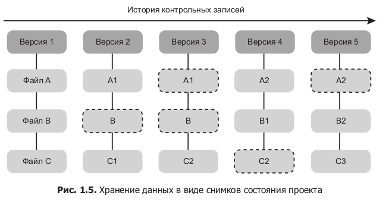

##Система контроля версий GIT

###RCS
Локальная система контроля версий позволяет делать разные версии проектов,
и хранить эти версии с датеровкой изменений, примером может являться система
`(Revision Control System, RCS)`

###CVCS или CVS
Централизованные системы контроля версий предназначены для совместной работы 
группы разработчиков, примером такой системы может являться`(Centralized Version Control System, CVCS)`
Данная система позволяет хранить набор версий на сервере, и набор пользователей
которые могут скачивать и загружать свои изменения. 

Однако при отключении интеренета или уничтожения информации на сервере, нельзя 
будет получить доступ к этой информации.

###GIT 
Распределенные системы контроля версий, зволяет не только загружать свою версию
изменений на сервер, она также делает полную копию версии репы с сервера, так 
образ при повреждении данных на сервере, можно полностью востановить данные на
сервере при помощи одной из локальных версий что останется на локальном ПК 
программиста.

Ядро Linux представляет собой крайне масштабный проект ПО с открытым исход-
ным кодом. В истории поддержки ядра Linux изменения программ долгое время
передавались в виде исправлений (patches) и архивированных файлов. В 2002 году
для проекта Linux стали использовать собственную систему DVCS, которая на-
зывалась BitKeeper.

В 2005 году отношения между сообществом, разрабатывавшим ядро Linux, и ком-
мерческой фирмой, создавшей BitKeeper, были разорваны и бесплатное использо-
вание этой системы контроля версий стало невозможным, что побудило сообщество
разработчиков Linux (и в частности создателя этой операционной системы Линуса
Торвальдса) начать работу над собственным инструментом, так и появился
GIT 2005 года.

###Снимки состояний а не изменений
Обычно системы контроля версий хранят 2 типа данных, сами файлы проекта и
список изменений которые проихошли от комита к комиту, GIT в отличии от других 
хранит не список изменений а состояние файла в конкретный момент, еслиже в
текущем комите файл не менялся то создается ссылка на его превыдущее состояние,
так образ происходит оптимизация.

Вся история комитов всех участников проектахранится ка кна сервере, так и на
локальной версии проекта, что позволяет просматривать историю комитов локально.

Перед сохранением в GIT числяет специальный уникальный ID по которомму в будущем
будет искаться сделанный коммит. GIT делает это механизмом хэша SHA-1
это строка из 40 символов, он вычисляет это не по имени файла а по хэшу их изменения.

