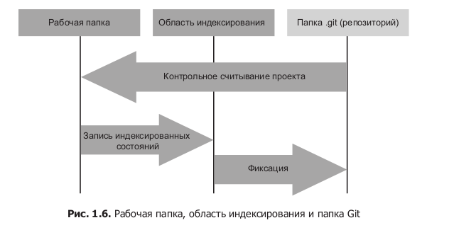

##GIT Урок №2
Файлы в GIT могут иметь только 3 состояния:

1) Зафиксированном (committed) - Данные надежно сохранены в локальной БД,
2) Модифицированном (modified) - Изменения внесены в файлы но пока не сохранены
в истории локально БД самого GIT
3) Индексированном (staged) - Изменения в файл внесены и зафиксированы в лок БД

1) Папка GIT место где хранятся метаданные и обьектная база данных проекта. 
2) Рабочая папка - место куда выполняется выгрузка одной из версий проекта, 
   эти файлы извлекаются из сжатой БД в папке GIT и помещаются на Жесткий Диск
3) Обл индексирования - это файл находящийся в папке GIT и хранит в себе 
инфу, что именно будет войдет в след коммит на сервер.

Установка GIT из стнадартного репозитория 

    // Наданный момент это версия 2.17
    apt-get install git 

###Начало работы
При установке git мы можем использовать утилиту `git config` при ее помощи
можно устанавливать переменные для работы самой системы git.

1) `/etc/gitconfig`  этом файле хранятся действующие для всех пользователей 
   системы и всех репозиториев. С этим файлом можно работать указав команду
   `--system`
   
В самой системе Linux в директории `etc/` либо есть либо нет, но будет создан 
при обращении к нему файл `gitconfig` в котором будут содержаться параметры 
для всех пользователей системы по стандарту.

Команда устанавливает имя пользователя для всех репозиториев GIT во всей систьеме

    sudo git config --system user.name "soneko"
    sudo git config --system user.email "soneko@email.ru"

Именно по этим праметрам если нету других будет по дефолту производиться коммит.
Если открыть файл `/etc/gitconfig` то можно увидеть след запись:

    [user]
	        name = soneko
	        email = soneko@email.ru
        
2) `~/.gitconfig` или `~/.config/git/config` Файл что хранит настройки для 
   конкретного пользователя,братиться к нему можно указав команду `--global`
   
Для установки настроект GIT для конкретного пользователя в системе:

    git config --global user.name "soneko"
    git config --global user.email "soneko@email.ru"

Эти параметры будут записаны в файл ~/gitconfig и распространяются только на 
пользователя хозяина данной директории.  

    
3) `.git/config` Конкретный фалй в в конкретном проекте, действует только на
этот проект.
   
Для конкретного проекта, если требуетс япереопределить параметры то следует
войти в директорию проекта, где находится папка .git и след команду:

    git config user.name "soneko"
    git config user.email "soneko@email.ru"

Таким образом можем увидеть что установка параметров в файлы конфигов 
для системы GIT работают по принцыпу Вложенной лексической области видимости,
прямо как работа областей видимости в JavaScript.

При комите GIT использует стандартный редактор для этой ОС, но его можно 
переопределить след командой:

    git config --global core.editor emacs

Увидеть настройки действующие в текущий момент можно командой

    git config --list

    Вывод:
        user.name=soneko
        user.email=soneko@email.ru
        user.email=popckov5@yandex.ru
        user.name=PopkovS
        core.editor=emacs

Здесь мы можем увидеть что GIT считывает все файлы настроек по степени 
вложенности, от верхнего уровня до нижнего, и встречая повторные значения
перезаписывает их тем самым и создается обл видимости.

Проверить конкретную натройку действующую на данный момент.

    git config user.name

    Вывод:
        PopkovS
