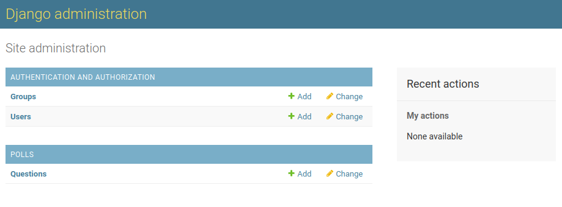

## Django урок 2
### Настройка Базы данных
В файле настроек `mysite/settings.py` определение с какой Бд будем 
работать,писывается в настрройке DATABASES, с параметрами для работы, 

Параметр ENGINE:

    'django.db.backends.sqlite3'
    'django.db.backends.postgresql'
    'django.db.backends.mysql'

Параметр NAME: Это название Бд, если используется SQLite то 
указывается файл.

Если в качестве БД используется sqlite3 то указывается полный путь к 
фалу, где это константа BASE_DIR / указывает на корень проекта.

Если мы используем БД SQLite то параметры подключения будут такими:

    DATABASES = {
        'default': {
            'ENGINE': 'django.db.backends.sqlite3',
            'NAME': BASE_DIR / 'db.sqlite3',
        }
    }

Если используем не SQLite то следует указать дополнительные параметры:

    DATABASES = {
        'default': {
            'ENGINE': 'django.db.backends.postgresql',
            'NAME': 'lessons-django',
            'USER': 'serg',
            'PASSWORD': '11',
            'HOST': '127.0.0.1',
            'PORT': '8000',
        }
    }

Параметр  INSTALLED_APPS содержит названия приложений что используются
в этом проекте:

1. django.contrib.admin - админка для Django.
2. django.contrib.staticfiles - приложение для работы со статическими 
   данными.
3. django.contrib.contenttypes - фреймворк типов данных.
4. django.contrib.sessions – фреймвор сессий.
5. django.contrib.messages – фреймворк сообщений.

Эти приложения активированы по дефолту, некотрые из них используют хотябы 
1 таблицу, этому перед использованием требуется создать эти таблицы для 
работы.

Запустить миграции для создание дефолтных таблиц в БД:

    python3 manage.py migrate

Команда migrate просматривает настройку INSTALLED_APPS и создает все 
необходимые таблицыля работы указанных там приложений.

### Создание моделей в приложении
Создадим в нашем приложении 2 модели Question и Choice.

Question содержит:
1. Вопрос 
2. Дату публикации. 

Choice содержит: 
1. Текст выбора 
2. Подсчет голосов. 

Каждый Choice связан с Question.

Для создания модели в приложении используется модуль `models` из `django.db`.

В отличии от Symfony, где все модели хоть и описаны в своих классах, и 
хранятся в отдельной директории, в Django для отдельного приложения все его 
модели, хранятся в одном единственном файле моделей,онкретно для этого 
приложения, добавим в модель `polls/models.py` описание 2 классов.

      from django.db import models

      # модель для вопросов с 2 полями
      class Question(models.Model):
          question_text = models.CharField(max_length=200)
          pub_date = models.DateTimeField('date published')
      
      # дель для выборово опросов 
      class Choice(models.Model):
          question = models.ForeignKey(Question, on_delete=models.CASCADE)
          choice_text = models.CharField(max_length=200)
          votes = models.IntegerField(default=0)

Тут все взаимодействие происходит через класс models, какждая модель 
наследуется от `django.db.models.Model` каждое свойство(поле) данного класса
реализуется как столбец таблицы и как класс наследуемый от `models`.

Каждое поле представлено своим классом:
   
1. models.CharField - реализет тип данных char
2. models.DateTimeField - дата/время
3. models.ForeignKey - внешний ключ
4. models.IntegerField - целое число

Особенным из всех этих полей является ForeignKey - который указывает на 
создание связи между таблицами, что каждая запись из Choice связана с одной 
записью Question, тоесть отношение 1 к 1.

### Активация моделей
После описания моделей, их нужно активировать,оесть сказать Django что 
требуется создать таблицы со связями в БД.

Суть в том чтобы подключать в проект приложения как модули и также легко их
отключать, чтобы включить приложение в проект требуется добавить на него 
ссылку в настройках `INSTALLED_APPS`

В приложении `polls` есть файл `polls/apps.py` с классом `PollsConfig`:

      from django.apps import AppConfig

      class PollsConfig(AppConfig):
         name = 'polls'

Поё этому путь его подключения такой `polls.apps.PollsConfig` теперь 
добавим путь в настройки для подключения для подключения приложения.
Таким образом получаем следующий конфиг приложений:
   
      INSTALLED_APPS = [
       'polls.apps.PollsConfig',
       'django.contrib.admin',
       'django.contrib.auth',
       'django.contrib.contenttypes',
       'django.contrib.sessions',
       'django.contrib.messages',
       'django.contrib.staticfiles',
   ]

Теперь Django знает что требуется подключить приложение `polls` и для запуска
применения миграций этого приложения, запустим след команнду:

      python3 manage.py makemigrations polls

Таким образом мы указываем jango чтобы он применил миграции конкретно этого 
приложения.

Выполнив команду применения миграций получим сообщение:

      Migrations for 'polls':
      polls/migrations/0001_initial.py
         - Create model Question
         - Create model Choice

Видим что миграции применены, и что в директории `migrations` был создан 
файл с описанием примененных миграций `0001_initial.py` и сообщение что 
обе модели были созданы.

### Просмотр SQL кода который выполняет миграция `sqlmigrate`
По мимо обычного применения миграции, можно еще посмотреть как выполняется 
сам SQL запрос, при помощи следующей команды где в качестве последнего 
аргумента используется номер файла с миграциями, команда `sqlmigrate` именно
позволяет посмотреть SQL код который применит миграция а не выполняет ее, 
код просмотра миграции следующий:

      python3 manage.py sqlmigrate polls 0001

В результате получаем следующий SQL:

      BEGIN;
      --
      -- Create model Question
      --
      CREATE TABLE "polls_question" (
          "id" serial NOT NULL PRIMARY KEY,
          "question_text" varchar(200) NOT NULL,
          "pub_date" timestamp with time zone NOT NULL
      );
      --
      -- Create model Choice
      --
      CREATE TABLE "polls_choice" (
          "id" serial NOT NULL PRIMARY KEY,
          "choice_text" varchar(200) NOT NULL,
          "votes" integer NOT NULL,
          "question_id" integer NOT NULL
      );
      ALTER TABLE "polls_choice"
        ADD CONSTRAINT "polls_choice_question_id_c5b4b260_fk_polls_question_id"
          FOREIGN KEY ("question_id")
          REFERENCES "polls_question" ("id")
          DEFERRABLE INITIALLY DEFERRED;
      CREATE INDEX "polls_choice_question_id_c5b4b260" ON "polls_choice" ("question_id");
      
      COMMIT;

Именно этот SQL и исполняется при применении миграции, обратим внимае на 
следующее:

1. В модели мы определили поля для таблицы, но среди них небыло первичного
   ключа, Dj автоматически при создании таблицы добавляет этот перввичный ключ, 
   давая ему название id.
   
2. В классе моделей мы определяли названия классов с большой буквы, в запросе
   видим что Dj автоматически переводит название моделей в нижний регистр, и 
   добавляет префикс в виде названия приложения, таким образом это позволяет
   по первому слову таблицы сразу определить к какому приложению оно относится
   `polls_choice` и `polls_question`.
   
3. Также при создании связи на уровне СУБД, название поля по которому будет 
   создана связь, `question` автоматически получает `id` для указания что это 
   поле `question_id` служит связью.
 
По мимо просмотр SQL при помощи `sqlmigrate` также есть команда для проверки
ошибок в миграциях, для этого используем команду:

      python3 manage.py check

В результате получаем ответ:

      System check identified no issues (0 silenced)

### Разница между makemigrations и migrate
Использование команды `python3 manage.py migrate` применяет 
те миграции что еще небыли применены, как и другие фреймворки, Dj содержит
в БД специальную таблицу `django_migrations` в которой отслеживается какие 
из миграций были пременены а какие нет. 

Тоесть мы имеем 2 разные команды, `makemigrations` - для создания миграций,
и `migrate` - для применения новых миграций.

### Работа с API
У Django имеется интерактивная оболочка, вызовем ее след командой:

      python3 manage.py shell

Попав в оболочку увидем сообщение типа:

      Type "help", "copyright", "credits" or "license" for more information.
      (InteractiveConsole)
      >>>

Используя эту оболочку можно взаимодействовать с любым приложением и моделью 
в проекте, что позволяет делать весь процесс CRUD операций с моделями.

### Административная часть сайта, создание суперпользователя.
В отличии от таких фреймворков как Symfonu что просто дают инструменты
без административной панели, в Dj сайт разделен на 2 отдельные части, 
публичный сайт что используется для демонстрации, и административной панели
которая автоматизирует всю работу с моделями.

#### Создание пользователя с правами администратора
Если административая часть является частью самого Dj и определять модели 
для нее не требуется, то естественно для создания суперпользователя с 
допуском в админку, автоматизированно следующей командой:

      python3 manage.py createsuperuser

      Username: admin

      Email address: admin@example.com

      Password: **********
      Password (again): *********
      Superuser created successfully.

Таким образом мы создаем суперпользователя с допуском в админку.

Теперь мы имеем допуск в административную часть проекта, войдем в админку
по следующему адресу: http://127.0.0.1:8000/admin/

Войдя в админку сайта мы увидим две категории: Группы и Пользователи.
они определены при помощи `django.contrib.auth` дефолтного приложения в Dj
которое определено по дефолту еще в файле настроек.
И позволяют создавать/редактировать ... пользователей и категории к которым 
они могут принадлежать.

По мимо стандартных моделей что поставляются из `django.contrib.auth` у нас 
есть созданное нами ранее приложение что имеет свои модели, если мы хоти 
добавить в админку возможность работать с этими моделями, нам требуется
зарегестрировать эти подели приложения как поставщика данных дл яадминки.

Добавление своего приложения в админку, для этого откроем в созданном
приложении файл `polls/admin.py` и внесем туда следующие строки.

      # мпортируем модуль для регистрации моделей в админке
      from django.contrib import admin
   
      # Импортируем модель для регистрации
      from .models import Question
   
      # регистрируем модель в админке как поставщика данных
      admin.site.register(Question)

Таким образом мы зарегестрировали модель из приложения как поставщика данных
для админки сайта. Видим что в админке появилась отдельная категория специально
для приложения polls с указанием всех моделей этого приложения:

